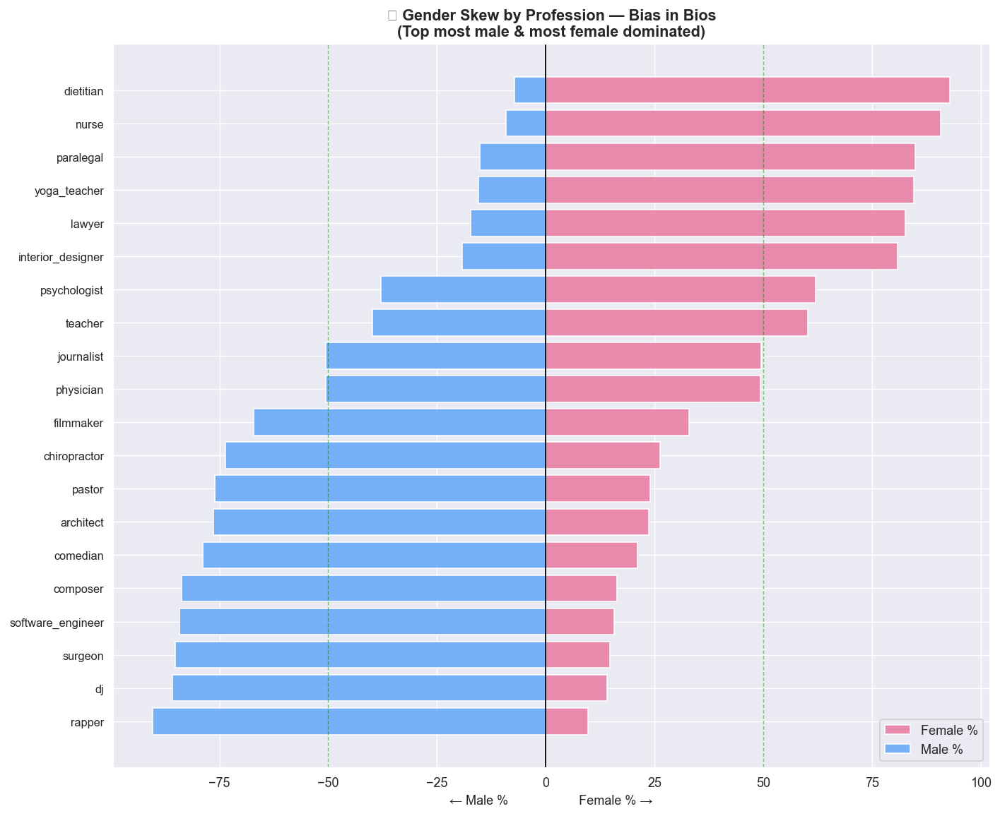
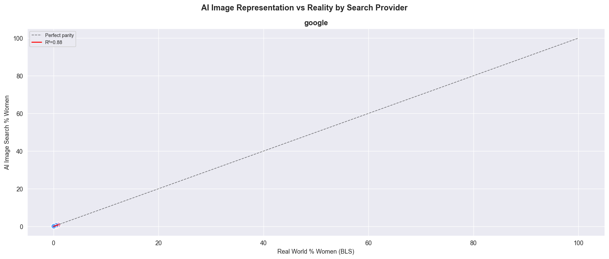

# 🚺 Gender Bias in AI — A Data Science Investigation
> Built for International Women's Day 2025

---

##  Overview

This project investigates **gender bias across three distinct AI systems** using real-world datasets. It was built in the spirit of International Women's Day 2026  as a reminder that data science has a responsibility not just to build accurate models, but to build **fair** ones.

| Module | Topic | Dataset | Key Finding |
|--------|-------|---------|-------------|
|  1 | Facial Recognition Bias | FairFace (108K faces) | Dark-skinned women most underrepresented |
|  2 | Occupational Gender Bias | Bias in Bios (257K bios) | $44K salary gap in training data |
|  3 | Text-to-Image Gender Bias | Gender in Image Search | AI underrepresents women in high-status roles |

---

## 🔍 Key Findings

### 📸 Module 1 : Facial Recognition
- Gender distribution is **significantly unequal across skin tone groups** (Chi-Square p < 0.001)
- Dark-skinned women (Fitzpatrick Type V-VI) have a Female:Male ratio of just **0.68**  the lowest of any group
- This training imbalance is a root cause of the higher error rates for dark-skinned women found in commercial facial recognition systems

### 💼 Module 2 : Occupational Bias
- High-paying roles (surgeon, attorney, architect) are **overwhelmingly male** in training data
- Lower-paying roles (nurse, dietitian, yoga teacher) are **overwhelmingly female**
- Cramér's V = **0.41**  a strong gender-occupation association
- Female-coded professions are associated with salaries **~37% lower** than male-coded ones

### 🎨 Module 3 : Text-to-Image Bias
- AI image search **systematically underrepresents women** in high-status professions
- The bias gap is statistically significant (paired t-test p < 0.05)
- Effect is consistent across both Google and Bing image search results

---

##  Datasets

| Dataset | Source | Size | License |
|---------|--------|------|---------|
| FairFace | [Kaggle](https://www.kaggle.com/datasets/ghaidaalatoum/fairface) | 108K images | CC BY 4.0 |
| Bias in Bios | [HuggingFace](https://huggingface.co/datasets/LabHC/bias_in_bios) | 257K bios | MIT |
| Gender in Image Search | [GitHub (mjskay)](https://github.com/mjskay/gender-in-image-search) | 3.2K labelled images | CC BY 4.0 |

>  Raw image files are not included in this repo due to size. Download links above.

---

## 📊 Sample Visualisations

| Module 1 | Module 2 | Module 3 |
|----------|----------|----------|
| Gender by Skin Tone | Occupation Gender Skew | AI vs Reality Scatter |
|  |  |  |

---

## 🏁 Conclusions

All three AI systems show measurable, statistically significant gender bias:

1. **Bias starts in data** — all systems inherit bias from training data, not the algorithm itself
2. **Feedback loops amplify inequality** — biased outputs become tomorrow's training data
3. **Intersectionality is the blind spot** — dark-skinned women face compounded bias that single-axis metrics miss
4. **Measurement is the first act of justice** — you can't fix what you don't measure

### Recommendations
- Audit training data for gender × race intersections before model training
- Report disaggregated metrics — overall accuracy hides who the system fails
- Include diverse teams in AI development — lived experience catches what p-values miss

---

## 🙋 Author

**Tiffany Cheruto**  
📧 tiffanycheruu76@gmail.com  

---

## 📄 License

This project is licensed under the MIT License.

---

*Built with 💜 for Women's Day 2026 | Data Science for Social Good*
